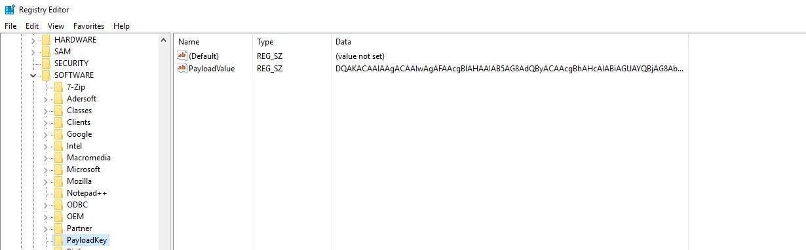

* TOC
{:toc}

# A few Links
- http://blog.trendmicro.com/trendlabs-security-intelligence/cryptocurrency-miner-uses-wmi-eternalblue-spread-filelessly/
- https://twitter.com/mattifestation/status/899646620148539397
- https://gist.github.com/mattifestation/e55843eef6c263608206 (Template)
- List of modules involved in each WMI event https://msdn.microsoft.com/en-us/library/aa940177(v=winembedded.5).aspx
- 

# What is WMI?

 
WMI is Microsoft's implementation of WBEM (Web Based Enterprise Management) which is based on [CIM](http://www.dmtf.org/standards/cim) and allows for the remote management of multiple system components in Windows environments. WMI is used on a daily basis by sysadmins across large domains due to its flexibility and scalability. Easy to deploy, scripts that leverage WMI can be seen everywhere. Unfortunately, as with everything that is widely deployed, has "remote" capabilities and runs on "windows": the dark force is strong around it [(just for fun: MS17-010)](https://technet.microsoft.com/en-us/library/security/ms17-010.aspx).
 
It is known that WMI can be abused in many ways to either gather information, make changes and create persistence mechanisms. An excellent article by Matt Graeber [(@mattifestation)](https://twitter.com/mattifestation?ref_src=twsrc%5Egoogle%7Ctwcamp%5Eserp%7Ctwgr%5Eauthor) called [Abusing Windows Management Instrumentation (WMI) to Build a Persistent, Asyncronous, and Fileless Backdoor](https://www.blackhat.com/docs/us-15/materials/us-15-Graeber-Abusing-Windows-Management-Instrumentation-WMI-To-Build-A-Persistent%20Asynchronous-And-Fileless-Backdoor-wp.pdf) was an eye opener for many of us in the cybersec world. We knew this was possible, but forgot how flexible it was. The main strength of WMI persistence is its stealthyness and effectiveness. When a command is executed by WMI as a result of "evil" the only thing you will see is **WmiPrvse.exe** as the process. Distinguishing a valid system action from an invalid one is very hard under these circumstances. In other words, WMI persistence defeats nonrepudiation!

What I will cover here are different methods for detecting WMI persistence that you could leverage within your network to hunt for this treat.

# Understanding WMI Persistence
First, rather than re-inventing the wheel, I will link here below the sources that I consulted to learn more about WMI: 
- Matt Graeber's article (mentioned above)
- Pentestarmoury article ["Creeping on Users with WMI Events"](https://pentestarmoury.com/2016/07/13/151/) by Sw4mp\_f0x. He also developed PowerLurk (see below)
- [Permanent WMI Subscriptions](https://learn-powershell.net/2013/08/14/powershell-and-events-permanent-wmi-event-subscriptions/)
- Derbycon 2015 [presentation](https://www.youtube.com/watch?v=HJLCvBq3oms) by Matt

# How does a WMI persistent object look like?
Let's use two scripts that allow us to easily create a malicious persistence without having to do it step by step (have a look at the PS files to understand all the bits and pieces involved), namely: 
- [PowerLurk](https://github.com/Sw4mpf0x/PowerLurk/blob/master/PowerLurk.ps1) by Sw4mp\_f0x
- [WMI Persistence Template](https://gist.github.com/mattifestation/e55843eef6c263608206) by Matt G.

## WMI Persistence Template by Matt G. 
We tweaked some of the parameters in the script to make sure the timer event launches every minute and that no cleanup is performed at the end. After launching it, we can inspect the newly created Event Consumers/Filters/Bindings as follows: 

**EventFilter**

Get-WmiObject -Namespace root\subscription -Class __EventFilter


Result: 

__GENUS          : 2
__CLASS          : __EventFilter
__SUPERCLASS     : __IndicationRelated
__DYNASTY        : __SystemClass
__RELPATH        : __EventFilter.Name="TimerTrigger"
__PROPERTY_COUNT : 6
__DERIVATION     : {__IndicationRelated, __SystemClass}
__SERVER         : W10B1
__NAMESPACE      : ROOT\subscription
__PATH           : \\W10B1\ROOT\subscription:__EventFilter.Name="TimerTrigger"
CreatorSID       : {1, 5, 0, 0...}
EventAccess      : 
EventNamespace   : root/cimv2
Name             : TimerTrigger
Query            : SELECT * FROM __TimerEvent WHERE TimerID = 'PayloadTrigger'
QueryLanguage    : WQL
PSComputerName   : W10B1


**EventConsumer**

Get-WmiObject -Namespace root\subscription -Class __EventConsumer


Result: 

[snip]
__GENUS               : 2
__CLASS               : CommandLineEventConsumer
__SUPERCLASS          : __EventConsumer
__DYNASTY             : __SystemClass
__RELPATH             : CommandLineEventConsumer.Name="ExecuteEvilPowerShell"
__PROPERTY_COUNT      : 27
__DERIVATION          : {__EventConsumer, __IndicationRelated, __SystemClass}
__SERVER              : W10B1
__NAMESPACE           : ROOT\subscription
__PATH                : \\W10B1\ROOT\subscription:CommandLineEventConsumer.Name="ExecuteEvilPowerShell"
CommandLineTemplate   : powershell.exe -NoP -C "iex ([Text.Encoding]::Unicode.GetString([Convert]::FromBase64String((Get-ItemProperty -Path HKLM:\SOFTWARE\PayloadKey -Name PayloadValue).PayloadValue)))"
[snip]



**FilterToConsumerBinding**

Get-WmiObject -Namespace root\subscription -Class __FilterToConsumerBinding


Result: 


[snip]
__NAMESPACE             : ROOT\subscription
__PATH                  : \\W10B1\ROOT\subscription:__FilterToConsumerBinding.Consumer="CommandLineEventConsumer.Name=\"ExecuteEvilPowerShell\"",Filter="__EventFilter.Name=\"TimerTrigger\""
Consumer                : CommandLineEventConsumer.Name="ExecuteEvilPowerShell"
CreatorSID              : {1, 5, 0, 0...}
DeliverSynchronously    : False
DeliveryQoS             : 
Filter                  : __EventFilter.Name="TimerTrigger"
[snip]



As we can observe, this persistence is based off a Timer *intrinsic* Event type. If you launched it and head to C:\ you will see the *payload\_result.txt* file as per the script: 


$TimerArgs = @{
    IntervalBetweenEvents = ([UInt32] 6000) # 6000 ms == 1 min
    SkipIfPassed = $False
    TimerId = $TimerName
}

$Payload = {
    # Prep your raw beacon stager along with Invoke-Shellcode here
    "Owned at $(Get-Date)" | Out-File C:\payload_result.txt
}


Let's look at the persistent registry key generated by the script via `Invoke-WmiMethod -Namespace root/default -Class StdRegProv -Name CreateKey -ArgumentList @($HiveVal, $PayloadKey)` (*creating the Registry Key*) & `Invoke-WmiMethod -Namespace root/default -Class StdRegProv -Name SetStringValue -ArgumentList @($HiveVal, $PayloadKey, $EncodedPayload, $PayloadValue)` (*storing the payload value inside the key*)


PS C:\Windows\system32> Get-ItemProperty 'HKLM:\SOFTWARE\PayloadKey'

PayloadValue : DQAKACAAIAAgACAAIwAgAFAAcgBlAHAAIAB5AG8AdQByACAAcgBhAHcAIABiAGUAYQBjAG8AbgAgAHMAdABhAGcAZQByACAAYQBsAG8AbgBnACAAdwBpAHQAaAAgAEkAbgB2AG8AawBlAC0AUwBoAGUAbABsAGMAbwBkAGUAIABoAGUAcgBlAA0ACgANAAoAIAAgACAAIAAiAE8AdwBuAGUAZAAgAGEAdAAgACQAKABHAGUAdAAtAEQAYQB0AGUAKQAiACAAfAAgAE8AdQB0AC0ARgBpAGwAZQAgAEMAOgBcAHAAYQB5AGwAbwBhAGQAXwByAGUAcwB1AGwAdAAuAHQAeAB0AA0ACgA=
PSPath       : Microsoft.PowerShell.Core\Registry::HKEY_LOCAL_MACHINE\SOFTWARE\PayloadKey
PSParentPath : Microsoft.PowerShell.Core\Registry::HKEY_LOCAL_MACHINE\SOFTWARE
PSChildName  : PayloadKey
PSDrive      : HKLM
PSProvider   : Microsoft.PowerShell.Core\Registry


Alternatively: 


We can observe the BASE64 ciphered payload (hold on to this, as it will become one of our detection artefacts later).

## Observables
The process that enacts most of the activities in the WMI world is WmiPrvSE.exe, so let's look at which modules are loaded by this process, immediately after creating this WMI persistence (range from 18/09/2017 23:00:00.000 to 19/09/2017 23:45:00.000): 
`Query: WmiPrvse AND (NOT *google* NOT splunk NOT TargetImage=*powershell* NOT TargetImage=*chrome* NOT TargetImage=*vmware* NOT EventCode=600) | reverse | search EventCode=7 | dedup ImageLoaded | stats count by _time, ImageLoaded | sort _time`
A snip follows (full CSV [here](../Files/WmiPrvSE_LoadedModules.csv))


If you inspect that CSV, you will notice something important, most of the libraries loaded by WmiPrvSE.exe come from the root of the trusted path under *C:\Windows\System32*. However, if we filter that out we observe the following: 
`Query: WmiPrvse AND (NOT *google* NOT splunk NOT TargetImage=*powershell* NOT TargetImage=*chrome* NOT TargetImage=*vmware* NOT EventCode=600) | reverse | search EventCode=7 | stats count by ImageLoaded | where match(ImageLoaded, "System32\\\\.*?\\\\") | sort _time`


These are the dlls that are most intimate to WMI's functionality in the system. There is one dll in particular that we need to take note ofn: **wbemcons.dll** ("cons"... "consumer"?, programmers need to call things in a distinguishable way for ease of use). I know it doesn't make sense just yet, but for the moment let's just hold on to this event as well. This library was loaded at 09/19/2017 11:44:22 PM.

Now to continue looking for connections, let's search for events where both WmiPrvse and Powershell are involved: 
`Query: WmiPrvse AND powershell (NOT *google* NOT splunk NOT TargetImage=*powershell* NOT TargetImage=*chrome* NOT TargetImage=*vmware* NOT EventCode=600) | reverse`

We are basically going to find two EventCodes: Sysmon 1 (ProcessCreate) and Windows Security 4688 (Process Creation). Main difference between the two is that Sysmon will provide you with the commandline (this can be enabled for Event 4688[^1] too). So let's take a closer look at the Sysmon events: 
`Query: WmiPrvse AND powershell AND EventCode=1 (NOT *google* NOT splunk NOT TargetImage=*powershell* NOT TargetImage=*chrome* NOT TargetImage=*vmware* NOT EventCode=600) | reverse | table _time, CommandLine, ParentImage`


TL;DR
> As you can observe, religiously, every 12 seconds there is a new event generated by Powershell and the parent is always WmiPrvSE.exe. Mere coincidence? Perhaps... the universe is full of bloody connections that we can't explain. However, taking a more rational approach (if there is such thing as *reason*) we shall adopt the posture that a coincidence is an event that points to a hidden link somewhere in the web of reality. The fact that you can't explain it doesn't mean there isn't one (the opposite is also true, but we are biologically tuned to perceibe *coincidences* as more attractive than *un-coincidences* or *unrelatedness*). So let's also hold on to this new fact: powershell spawned by WmiPrvSE with juicy keywords like **iex**.

The truth is that the 12s interval is the one we configured for our \_Timer event when launching the WMI persistence script. 
The plot thikens when we change the **AND** for an **OR** and search for events either refering to WmiPrvSE or Powershell: 


This time you will observe that immediately after powershell is started by WmiPrvSE, a new conhost process is started by powershell. This makes sense, as powershell requires a console for a brief moment to execute the command in the background.

Now let's this time throw in that juicy **iex** keyword to the mix and see what it comes up with: 
`Query: WmiPrvse OR powershell AND "iex" (NOT *google* NOT splunk NOT TargetImage=*powershell* NOT TargetImage=*wmiprvse* NOT TargetImage=*chrome* NOT TargetImage=*vmware* NOT EventCode=600) | reverse | table _time, EventCode, Message`

This is just a snip (full csv [here](../Files/Wmi_iex.csv))


We start observing some other interesting events poping up here. Disregarding Sysmon EventCode 20 (belongs to the new 6.10 version) which will be dissected later, we can see 5861 (Source: Microsoft-Windows-WMI-Activity/Operational)[^2], 400 (Source: Windows Powershell / Message: Engine state is changed from None to Available)[^3] and 403 (Source: Windows Powershell / Message: Engine state is changed from Available to Stopped)[^4]. All of them are standard Windows Events, I haven't "enabled" anything in particular here. I'm just farming what the OS already gives you by default. 
The interesting thing about all these events is that they all reveal 

-------------------------------------------------------------------------------------------------------
[^1]: Since Win 8 and Server 2012: http://windowsitpro.com/security/understanding-and-enabling-command-line-auditing
[^2]: EventCode 5861 sample contents:
```
09/19/2017 11:44:10 PM
LogName=Microsoft-Windows-WMI-Activity/Operational
SourceName=Microsoft-Windows-WMI-Activity
EventCode=5861
EventType=0
Type=Information
ComputerName=W10B1
User=NOT_TRANSLATED
Sid=S-1-5-18
SidType=0
TaskCategory=The operation completed successfully.
OpCode=Info
RecordNumber=2080
Keywords=None
Message=Namespace = //./root/subscription; Eventfilter = TimerTrigger (refer to its activate eventid:5859); Consumer = CommandLineEventConsumer="ExecuteEvilPowerShell"; PossibleCause = Binding EventFilter: 
instance of __EventFilter
{
	CreatorSID = {1, 5, 0, 0, 0, 0, 0, 5, 21, 0, 0, 0, 61, 142, 116, 171, 40, 226, 113, 232, 97, 254, 162, 59, 233, 3, 0, 0};
	EventNamespace = "root/cimv2";
	Name = "TimerTrigger";
	Query = "SELECT * FROM __TimerEvent WHERE TimerID = 'PayloadTrigger'";
	QueryLanguage = "WQL";
};
Perm. Consumer: 
instance of CommandLineEventConsumer
{
	CommandLineTemplate = "powershell.exe -NoP -C \"iex ([Text.Encoding]::Unicode.GetString([Convert]::FromBase64String((Get-ItemProperty -Path HKLM:\\SOFTWARE\\PayloadKey -Name PayloadValue).PayloadValue)))\"";
	CreatorSID = {1, 5, 0, 0, 0, 0, 0, 5, 21, 0, 0, 0, 61, 142, 116, 171, 40, 226, 113, 232, 97, 254, 162, 59, 233, 3, 0, 0};
	Name = "ExecuteEvilPowerShell";
};
```
[^3]: EventCode 400 sample contents:
```
09/19/2017 11:44:22 PM
LogName=Windows PowerShell
SourceName=PowerShell
EventCode=400
EventType=4
Type=Information
ComputerName=W10B1
TaskCategory=Engine Lifecycle
OpCode=Info
RecordNumber=56
Keywords=Classic
Message=Engine state is changed from None to Available. 

Details: 
	NewEngineState=Available
	PreviousEngineState=None

	SequenceNumber=13

	HostName=ConsoleHost
	HostVersion=5.1.14393.206
	HostId=9ebd19fb-d695-44ec-a9b1-51d48db8b1ef
	HostApplication=powershell.exe -NoP -C iex ([Text.Encoding]::Unicode.GetString([Convert]::FromBase64String((Get-ItemProperty -Path HKLM:\SOFTWARE\PayloadKey -Name PayloadValue).PayloadValue)))
	EngineVersion=5.1.14393.206
	RunspaceId=0a4191f5-9ee9-417b-9ebe-fbb73aa20b37
	PipelineId=
	CommandName=
	CommandType=
	ScriptName=
	CommandPath=
	CommandLine=
```

[^4]: EventCode 403 sample contents:
```
09/19/2017 11:44:23 PM
LogName=Windows PowerShell
SourceName=PowerShell
EventCode=403
EventType=4
Type=Information
ComputerName=W10B1
TaskCategory=Engine Lifecycle
OpCode=Info
RecordNumber=57
Keywords=Classic
Message=Engine state is changed from Available to Stopped. 

Details: 
	NewEngineState=Stopped
	PreviousEngineState=Available

	SequenceNumber=15

	HostName=ConsoleHost
	HostVersion=5.1.14393.206
	HostId=9ebd19fb-d695-44ec-a9b1-51d48db8b1ef
	HostApplication=powershell.exe -NoP -C iex ([Text.Encoding]::Unicode.GetString([Convert]::FromBase64String((Get-ItemProperty -Path HKLM:\SOFTWARE\PayloadKey -Name PayloadValue).PayloadValue)))
	EngineVersion=5.1.14393.206
	RunspaceId=0a4191f5-9ee9-417b-9ebe-fbb73aa20b37
	PipelineId=
	CommandName=
	CommandType=
	ScriptName=
	CommandPath=
	CommandLine=
```
=======================================================================================================


Notes
- EventCode 600, "Provider LifeCycle", Message "Provider Registry Started", shows the powershell payload under "HostApplication"
- Sysmon Event 4, "Registry Object added or deleted" shows the creation of "HKLM\SOFTWARE\PayloadKey" by Image "C:\Windows\system32\wbem\wmiprvse.exe"
- Sysmon Event 4, "Registry Value Set" shows a BASE64 payload (include here the IOC to detect such B64 payloads as Artifact I)

Detection Artefacts: 
- Artifact 1: B64 payload in registry
- Artifact 2: wbemcons.dll called when WmiPrvse.exe invokes a CommandLineEventConsumer event
- Artifact 3: EventCode 600
- Artifact 4: 

# Changes to your Sysmon Config
We will add a tag for the new event that has a pretty tight condition: it will only collect WMI events when they are created. This way, the FP ratio is reduced to a minimum, but as a tradeoff you need to be really paying attention and treat Alarms pertaining to these events as critical *always*. 

<!--SYSMON EVENT ID 19,20,21 : WMIEvent-->
<WmiEvent onmatch="include">
	<Operation condition="is">Created</Operation>
</WmiEvent>



Other References: 
- https://msdn.microsoft.com/en-us/library/aa392282(v=vs.85).aspx This explains how to create an NTEventLogEventConsumer class and how to setup one of its properties (insertionstrings) to a string. It also does this via MOF and compiling the MOF. The MOF then is embedded in OBJECTS.DATA. WMIPers is not parsing the "\_EventConsumer" for these events very well, must look into that. The interesting thing though is that you could store anything in those "strings", why not a payload?
- https://msdn.microsoft.com/en-us/library/aa393016(v=vs.85).aspx Ability to register EventConsumers and EventFilters can be restricted by setting the EventAccess attribute of the EventFilter instance. 


