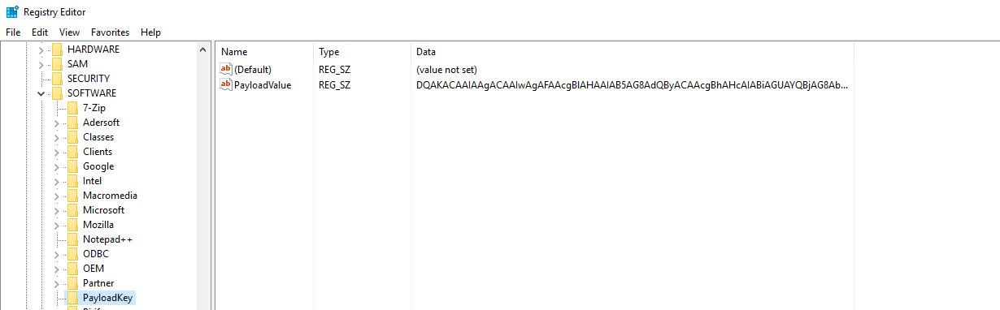
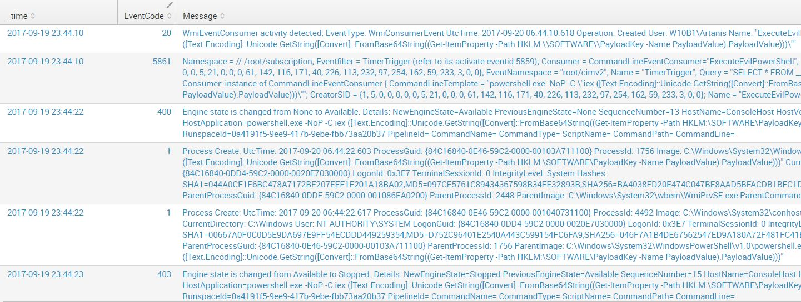

* TOC
{:toc}

# What is WMI?

WMI is Microsoft's implementation of WBEM (Web Based Enterprise Management) which is based on [CIM](http://www.dmtf.org/standards/cim) and allows for the remote management of multiple system components in Windows environments. WMI is used on a daily basis by sysadmins across large domains due to its flexibility and scalability. Easy to deploy, scripts that leverage WMI can be seen everywhere. Unfortunately, as with everything that is widely deployed, has "remote" capabilities and runs on "windows": the dark force is strong around it [(just for fun: MS17-010)](https://technet.microsoft.com/en-us/library/security/ms17-010.aspx).
 
It is known that WMI can be abused in many ways to either gather information, make changes and create persistence mechanisms. An excellent article by Matt Graeber [(@mattifestation)](https://twitter.com/mattifestation?ref_src=twsrc%5Egoogle%7Ctwcamp%5Eserp%7Ctwgr%5Eauthor) called [Abusing Windows Management Instrumentation (WMI) to Build a Persistent, Asyncronous, and Fileless Backdoor](https://www.blackhat.com/docs/us-15/materials/us-15-Graeber-Abusing-Windows-Management-Instrumentation-WMI-To-Build-A-Persistent%20Asynchronous-And-Fileless-Backdoor-wp.pdf) was an eye opener for many of us in the cybersec world. We knew this was possible, but forgot how flexible it was. The main strength of WMI persistence is its stealthyness and effectiveness. When a command is executed by WMI as a result of "evil" the only thing you will see is **WmiPrvse.exe** as the process. Distinguishing a valid system action from an invalid one is very hard under these circumstances. In other words, WMI persistence defeats nonrepudiation!

What I will cover here are different methods for detecting WMI persistence that you could leverage within your network to hunt for this treat.

# Understanding WMI Persistence
First, rather than re-inventing the wheel, I will link here below the sources that I consulted to learn more about WMI: 
- Matt Graeber's article (mentioned above)
- Pentestarmoury article ["Creeping on Users with WMI Events"](https://pentestarmoury.com/2016/07/13/151/) by Sw4mp\_f0x. He also developed PowerLurk (see below)
- [Permanent WMI Subscriptions](https://learn-powershell.net/2013/08/14/powershell-and-events-permanent-wmi-event-subscriptions/)
- Derbycon 2015 [presentation](https://www.youtube.com/watch?v=HJLCvBq3oms) by Matt

# How does a WMI persistent object look like?
Let's use two scripts that allow us to easily create a malicious persistence without having to do it step by step (have a look at the PS files to understand all the bits and pieces involved), namely: 
- [PowerLurk](https://github.com/Sw4mpf0x/PowerLurk/blob/master/PowerLurk.ps1) by Sw4mp\_f0x
- [WMI Persistence Template Gist](https://gist.github.com/mattifestation/e55843eef6c263608206) by Matt G.
- Alternatively, you can also use an adaptation of Matt's work by **n0pe-sled** [WMI-Persistence.ps1](https://github.com/n0pe-sled/WMI-Persistence/blob/master/WMI-Persistence.ps1)

## WMI Persistence Template by Matt G. 
We tweaked some of the parameters in the script to make sure the timer event launches every minute and that no cleanup is performed at the end. After launching it, we can inspect the newly created Event Consumers/Filters/Bindings as follows: 

**EventFilter**

Get-WmiObject -Namespace root\subscription -Class __EventFilter


Result: 
```Powershell
__GENUS          : 2
__CLASS          : __EventFilter
__SUPERCLASS     : __IndicationRelated
__DYNASTY        : __SystemClass
__RELPATH        : __EventFilter.Name="TimerTrigger"
__PROPERTY_COUNT : 6
__DERIVATION     : {__IndicationRelated, __SystemClass}
__SERVER         : W10B1
__NAMESPACE      : ROOT\subscription
__PATH           : \\W10B1\ROOT\subscription:__EventFilter.Name="TimerTrigger"
CreatorSID       : {1, 5, 0, 0...}
EventAccess      : 
EventNamespace   : root/cimv2
Name             : TimerTrigger
**Query            : SELECT * FROM __TimerEvent WHERE TimerID = 'PayloadTrigger'**
QueryLanguage    : WQL
PSComputerName   : W10B1
```

**EventConsumer**
```Powershell
Get-WmiObject -Namespace root\subscription -Class __EventConsumer
```
Result: 
[snip]
```Powershell
__GENUS               : 2
__CLASS               : CommandLineEventConsumer
__SUPERCLASS          : __EventConsumer
__DYNASTY             : __SystemClass
__RELPATH             : CommandLineEventConsumer.Name="ExecuteEvilPowerShell"
__PROPERTY_COUNT      : 27
__DERIVATION          : {__EventConsumer, __IndicationRelated, __SystemClass}
__SERVER              : W10B1
__NAMESPACE           : ROOT\subscription
__PATH                : \\W10B1\ROOT\subscription:CommandLineEventConsumer.Name="ExecuteEvilPowerShell"
**CommandLineTemplate   : powershell.exe -NoP -C "iex ([Text.Encoding]::Unicode.GetString([Convert]::FromBase64String((Get-ItemProperty -Path HKLM:\SOFTWARE\PayloadKey -Name PayloadValue).PayloadValue)))"**
```
[snip]

**FilterToConsumerBinding**
```Powershell
Get-WmiObject -Namespace root\subscription -Class __FilterToConsumerBinding
```
Result: 
[snip]
```Powershell
__NAMESPACE             : ROOT\subscription
**__PATH                  : \\W10B1\ROOT\subscription:__FilterToConsumerBinding.Consumer="CommandLineEventConsumer.Name=\"ExecuteEvilPowerShell\"",Filter="__EventFilter.Name=\"TimerTrigger\""**
**Consumer                : CommandLineEventConsumer.Name="ExecuteEvilPowerShell"**
CreatorSID              : {1, 5, 0, 0...}
DeliverSynchronously    : False
DeliveryQoS             : 
**Filter                  : __EventFilter.Name="TimerTrigger"**
```

As we can observe, this persistence is based off a Timer *intrinsic* Event type. If you launched it and head to C:\ you will see the *payload\_result.txt* file as per the script: 


$TimerArgs = @{
    IntervalBetweenEvents = ([UInt32] 6000) # 6000 ms == 1 min
    SkipIfPassed = $False
    TimerId = $TimerName
}

$Payload = {
    # Prep your raw beacon stager along with Invoke-Shellcode here
    "Owned at $(Get-Date)" | Out-File C:\payload_result.txt
}


Let's look at the persistent registry key generated by the script via `Invoke-WmiMethod -Namespace root/default -Class StdRegProv -Name CreateKey -ArgumentList @($HiveVal, $PayloadKey)` (*creating the Registry Key*) & `Invoke-WmiMethod -Namespace root/default -Class StdRegProv -Name SetStringValue -ArgumentList @($HiveVal, $PayloadKey, $EncodedPayload, $PayloadValue)` (*storing the payload value inside the key*)


PS C:\Windows\system32> Get-ItemProperty 'HKLM:\SOFTWARE\PayloadKey'

PayloadValue : DQAKACAAIAAgACAAIwAgAFAAcgBlAHAAIAB5AG8AdQByACAAcgBhAHcAIABiAGUAYQBjAG8AbgAgAHMAdABhAGcAZQByACAAYQBsAG8AbgBnACAAdwBpAHQAaAAgAEkAbgB2AG8AawBlAC0AUwBoAGUAbABsAGMAbwBkAGUAIABoAGUAcgBlAA0ACgANAAoAIAAgACAAIAAiAE8AdwBuAGUAZAAgAGEAdAAgACQAKABHAGUAdAAtAEQAYQB0AGUAKQAiACAAfAAgAE8AdQB0AC0ARgBpAGwAZQAgAEMAOgBcAHAAYQB5AGwAbwBhAGQAXwByAGUAcwB1AGwAdAAuAHQAeAB0AA0ACgA=
PSPath       : Microsoft.PowerShell.Core\Registry::HKEY_LOCAL_MACHINE\SOFTWARE\PayloadKey
PSParentPath : Microsoft.PowerShell.Core\Registry::HKEY_LOCAL_MACHINE\SOFTWARE
PSChildName  : PayloadKey
PSDrive      : HKLM
PSProvider   : Microsoft.PowerShell.Core\Registry


Alternatively: 


We can observe the BASE64 ciphered payload (hold on to this, as it will become one of our detection artefacts later).

Now let's time throw in that juicy **iex** keyword to the mix and see what it comes up with: 
`Query: WmiPrvse OR powershell AND "iex" (NOT *google* NOT splunk NOT TargetImage=*powershell* NOT TargetImage=*wmiprvse* NOT TargetImage=*chrome* NOT TargetImage=*vmware* NOT EventCode=600) | reverse | table _time, EventCode, Message`

This is just a snip (full csv [here](../Files/Wmi_iex.csv))



We start observing some other interesting events poping up here. Disregarding Sysmon EventCode 20 (belongs to the new 6.10 version) which will be dissected later, we can see 5861 (Source: Microsoft-Windows-WMI-Activity/Operational), 400 (Source: Windows Powershell / Message: Engine state is changed from None to Available)[^2] and 403 (Source: Windows Powershell / Message: Engine state is changed from Available to Stopped)[^3]. All of them are standard Windows Events, I haven't "enabled" anything in particular here. I'm just farming what the OS already gives you by default. 

The interesting thing about all these events is that they all reveal the powershell code used as payload: `powershell.exe -NoP -C iex ([Text.Encoding]::Unicode.GetString([Convert]::FromBase64String((Get-ItemProperty -Path HKLM:\SOFTWARE\PayloadKey -Name PayloadValue).PayloadValue)))`

Most interesting of them all is Event 5861, which is givin us a lot of information about the persistence, namely the Binding itself.

## WMI Persistence via PowerLurk by Sw4mpf0x 
We can reproduce the same Timer Triggered Event as above with more ease with this great script which allows for a lot of flexibility. 
```Powershell
Register-MaliciousWMIEvent -EventName MaliciousWMIEvent -LocalScriptBlock {Invoke-Expression -Command "cmd /c calc.exe"} -Trigger Interval -IntervalPeriod 60 -TimerId MaliciousTimer
```
this will simply start calc every 60 seconds and we can see the timer event
```Powershell
__GENUS               : 2
__CLASS               : __IntervalTimerInstruction
__SUPERCLASS          : __TimerInstruction
__DYNASTY             : __SystemClass
__RELPATH             : __IntervalTimerInstruction.TimerId="MaliciousTimer"
__PROPERTY_COUNT      : 3
__DERIVATION          : {__TimerInstruction, __EventGenerator, __IndicationRelated, __SystemClass}
__SERVER              : W10B1
__NAMESPACE           : ROOT\cimv2
__PATH                : **\\W10B1\ROOT\cimv2:__IntervalTimerInstruction.TimerId="MaliciousTimer"**
IntervalBetweenEvents : 60000
SkipIfPassed          : False
TimerId               : MaliciousTimer
PSComputerName        : W10B1
```
Let's go ahead and remove it though:
```Powershell
Get-WMIObject -Namespace root\Subscription -Class __FilterToConsumerBinding | Remove-WmiObject -Verbose
Get-WMIObject -Namespace root\Subscription -Class __EventFilter | Remove-WmiObject -Verbose
Get-WMIObject -Namespace root\Subscription -Class __EventConsumer | Remove-WmiObject -Verbose
Get-WmiObject -Class __IntervalTimerInstruction | Remove-WmiObject -Verbose
```

We can do many more things, but this post is mainly about how to detect such sneaky persistence mechanisms, so let's go ahead and grab our majestic *free* install of Splunk Enterprise with a 60 day trial and let's make use of our best friend Sysmon the Great. 

# WMI Persistence Detection
For the purposes of this test, I've used a "log all" approach with Sysmon, you can find a sample config file [here](https://github.com/darkquasar/THL/blob/master/Templates/SysmonConfig-LogAll.xml)(*Threat Hunting Ecosystem as a Code* is my next project, don't look at it yet, it's ugly!)

So let's go ahead and create a new TimerEvent and see what our logs come up with. We shall use the following search: 
```
LogName=Microsoft-Windows-WMI-Activity/Operational AND NOT EventCode=5858 AND NOT "sysmon"
```

1. First thing we notice is that Windows already comes with a default "WMI-Event Detector" which is **Event Id 5860** in the *Microsoft-Windows-WMI-Activity/Operational* Log


2. Second, becase I am running Powershell v5, Script Block Auditing is enabled by default, hence, the malicious script was also captured: 


3. We also notice via another Event Id 5860 that some application with the Process Id 2024 issued a query to the WMI provider: 


Who is this guy?  

```Powershell
PS C:\WINDOWS\system32> Get-Process -Id 2024

Handles  NPM(K)    PM(K)      WS(K)     CPU(s)     Id  SI ProcessName                                                         
-------  ------    -----      -----     ------     --  -- -----------                                                         
    425      20    22676      21804     174.56   2024   0 Sysmon64      
```

TL;DR. Well it seems that the new capability added by Sysmon to monitor WMI Events (SYSMON EVENT ID 19 & 20 & 21 : WMI EVENT MONITORING [WmiEvent]) is nothing else but a few queries issued to the WMI service which are then reported back to their own log space (Sysmon/Operational). Essentially sysmon is registering itself here as a subscriber for intrinsic events. This pretty much means Sysmon is duplicating on effort here, since Windows already comes with native events to detect WMI operations. It doesn't mean though that this feature is plain redundant, since our logging architecture could be simplified by just looking at Sysmon events rather than having to fork to Windows native events for WMI. Anyway, let's keep digging shall we ;)

What would happen if we create a script event consumer? 
```Powershell
$script = @’
Set objFSO=CreateObject("Scripting.FileSystemObject")
outFile="c:\test\log.txt"
Set objFile = objFSO.CreateTextFile(outFile,True)
objFile.Write "%TargetInstance.ProcessName% started at PID %TargetInstance.ProcessId%" & vbCrLf
objFile.Close
‘@

Register-MaliciousWmiEvent -EventName CalcMalicious -PermanentScript $script -Trigger ProcessStart -ProcessName notepad.exe -ScriptingEngine VBScript
```


As we can observe, this pretty handy Windows Event Id **5861** provides all the information pertaining to the FilterToConsumerBinding, the EventConsumer and EventFilter

We also observe Windows Event Id **5859** showing the EventFilter which is effectively registered in the NotificationQueue: 
```Powershell
LogName=Microsoft-Windows-WMI-Activity/Operational
SourceName=Microsoft-Windows-WMI-Activity
EventCode=5859
EventType=0
Type=Information
ComputerName=W10B1
User=NOT_TRANSLATED
Sid=S-1-5-18
SidType=0
TaskCategory=The operation completed successfully.
OpCode=Info
RecordNumber=321
Keywords=None
Message=Namespace = //./root/CIMV2; NotificationQuery = SELECT * FROM Win32_ProcessStartTrace WHERE ProcessName='notepad.exe'; OwnerName = S-1-5-21-2876542525-3899777576-1000537697-1001; HostProcessID = 972;  Provider= WMI Kernel Trace Event Provider, queryID = 0; PossibleCause = Permanent
```

And one other small but important piece of information is the presence of Event Id **5857** which is telling us who the provider is (an executable) whose task is to carry out the actions determined in the EventConsumer class: 
```Powershell
LogName=Microsoft-Windows-WMI-Activity/Operational
SourceName=Microsoft-Windows-WMI-Activity
EventCode=5857
EventType=0
Type=Information
ComputerName=W10B1
User=NOT_TRANSLATED
Sid=S-1-5-18
SidType=0
TaskCategory=The operation completed successfully.
OpCode=Info
RecordNumber=322
Keywords=None
Message=ActiveScriptEventConsumer provider started with result code 0x0. HostProcess = wmiprvse.exe; ProcessID = 972; ProviderPath = %SystemRoot%\system32\wbem\scrcons.exe
```

Let's commit that to memory for a second: **%SystemRoot%\system32\wbem\scrcons.exe**. What the event is telling us is the executable in charge of running our script. Ridding the Google brave horses I was able to obtain good answers from the Internet Elders: https://msdn.microsoft.com/en-us/library/aa940177(v=winembedded.5).aspx Here it says that these are the handlers for common event consumers: 

```
    Scrcons.exe. ActiveScriptEventConsumer
    Smtpcons.dll. SMTPEventConsumer
    Wbemcons.dll. CommandLineEventConsumer, NTEventLogEventConsumer, LogFileEventConsumer
```

So essentially, even if you are **NOT** monitoring for either Sysmon Events 19, 20 & 21 or Windows native Events in the WMI/Operational space Ids 5857, 5859, 5860 & 5861, you can **still** detect the presence of potentially malicious WMI persistence by leveraging the event consumer handlers listed above. Let's ask Sysmon for *Scrcons.exe*
THL-02-05

Now what a surprise! you would be expeting that *WmiPrvse.exe* would start *scrcons.exe*, instead it's this regular non-profit bloke *svchost.exe*. Sysmon is even providing us with the name `Description: WMI Standard Event Consumer - scripting` 
Looking for further clues of *scrcons.exe* returns a Sysmon Event Id 11 (File Created) event where our little friend created a file. 
THL-02-06

If we were expecting to see this file, created as a result of the VBScript that we ran with the event consumer, written to disk by wscript.exe we will be dissapointed.

This time though, Sysmon seems to have noticed that a malicious event subscription was created and here we have it: 
```Powershell
Get-WinEvent -FilterHashtable @{logname="Microsoft-Windows-Sysmon/Operational";id=20} | Select-Object -ExpandProperty Message

WmiEventConsumer activity detected:
EventType: WmiConsumerEvent
UtcTime: 2018-03-02 14:17:53.442
Operation: Created
User: W10B1\Artanis
Name:  "CalcMalicious"
Type: Script
Destination:  "Set objFSO=CreateObject(\"Scripting.FileSystemObject\")\noutFile=\"c:\\test\\log.txt\"\nSet objFile = objFSO.Cre
ateTextFile(outFile,True)\nobjFile.Write \"%TargetInstance.ProcessName% started at PID %TargetInstance.ProcessId%\" & vbCrLf\no
bjFile.Close"
```
If you are using Sysmon events to monitor for WMI event subscriptions, you only need to capture the results of Event Id 19 as it will display the *event consumer* which is were the juicy information is that allows us to discriminate benign from malicious. 

What happens if we instead create a CommandLine Event Subscription instead of a Script based one? The command would look like this with PowerLurk: 
```Powershell
Register-MaliciousWmiEvent -EventName LogCalc1 -PermanentCommand “cmd.exe /c msg Artanis This is Persistence!” -Trigger ProcessStart -ProcessName calculator.exe
```

This time, instead of *scrcons.exe* we shall see *wbemcons.dll* as the event handler, and instead of being a child of *svchost.exe* the parent will be *WmiPrvse.exe*. In all my experimental hunts I can assure you that the precense of *wbemcons.dll* as a child of *WmiPrvse.exe* is **extremely rare**, so do pay attention to those if you are not monitoring WMI/Operational native Windows events. 

I will leave it as an exercise to the reader to investigate which events are generated by creating a CommandLine Event Consumer. 

## What about DFIR? 
It happens to be the case that any permanent event subscription gets written to a WMI database file called OBJECTS.DATA that can be located here: 
- C:\Windows\System32\wbem\Repository\OBJECTS.DATA
- C:\Windows\System32\wbem\Repository\FS\OBJECTS.DATA

It turns out that the information pertaining WMI event subscriptions can be located there in plain text. The file has a binary format and its structure, AFAIK, is undocumented. However, there are a few out there that were brave enough to come up with some cool python scripts that make use of *The Sword of RegEx The Great and Meticulous* that allow for parsing of these files, namely: 

- https://github.com/darkquasar/WMI_Persistence (developed by me)
- https://github.com/davidpany/WMI_Forensics (David Pany script)
- https://github.com/fireeye/flare-wmi (a few scripts by FireEye analysts)

So even if you are (well... luckily after reading this post "were") not collecting any WMI telemetry data in your environment, you can still go out there and hunt for these threats by collecting all the OBJECTS.DATA files in your hosts. The scripts listed above allow for easy parsing of a folder full of these files so the heavy lifting will be on the *collecting* side of things ;)

# Detection Logics & Lessons Learned
You may think that WMI fileless persistence and malware execution mechanisms are a very low risk threat thus spending business cycles into creating a detection for this drops way down the list of priorities. It is, however, an extremely easy to detect tactic and if your priority list is not packed with threat scenarios like this one then you are not putting toghether a proper list! We all know looking at detailed TTPs is a tedious process, but only by adopting a systemic approach you will be able to extend your detection & prevention surface. It's an ants work, mixed with that of a dragon. 

## So, to summarize: 

| Monitor                                                                                                                                                                                                                 | Detect                                                        | Suited for                                                                                                                                                                                   |
|-------------------------------------------------------------------------------------------------------------------------------------------------------------------------------------------------------------------------|---------------------------------------------------------------|----------------------------------------------------------------------------------------------------------------------------------------------------------------------------------------------|
| Sysmon Event Id 11 (File Write) where "Image" is "C:\WINDOWS\system32\wbem\scrcons.exe".                                                                                                                                | Suspicious files written by the script event consumer handler | Environments with Sysmon monitoring                                                                                                                                                          |
| Sysmon Event Id 1 where "ParentImage" is C:\Windows\System32\svchost.exe AND Image is "C:\WINDOWS\system32\wbem\scrcons.exe". Alternatively Windows Security Log Event ID 4688 (Process Created) can also be monitored. | Instances of an Active Script Event Consumer WMI Persistence  | When you are not monitoring Windows native WMI/Operational events OR,when a malicious actor disabled native windows event logging and you have another technology in place (for example EDR) |
| Sysmon Event Id 1 where "ParentImage" is C:\Windows\System32\wbem\WmiPrvSE.exe AND Image contains "wbemcons.dll". Alternatively Windows Security Log Event ID 4688 (Process Created) can also be monitored.             | Instances of an Active CommandLine Event Consumer Persistence | When you are not monitoring Windows native WMI/Operational events,OR,when a malicious actor disabled native windows event logging and you,have another technology in place (for example EDR) |
| Windows Event Id 5859 in WMI-Activity/Operational                                                                                                                                                                       | Suspicious Event Consumers                                    | Environments with no Sysmon monitoring using solely native Windows Events                                                                                                                    |
| Windows Event Id 5861 in WMI-Activity/Operational                                                                                                                                                                       | Suspicious Event Filters                                      | Environments with no Sysmon monitoring using solely native Windows Events                                                                                                                    |

Hopefully in my next post I will resume the Mimikatz one and then I will jump into Meterpreter detections ;)

## Changes to your Sysmon Config
We will add a tag for the new event that has a pretty tight condition: it will only collect WMI events when they are created. This way, the FP ratio is reduced to a minimum, but as a tradeoff you need to be really paying attention and treat Alarms pertaining to these events as critical *always*. 

<!--SYSMON EVENT ID 19,20,21 : WMIEvent-->
<WmiEvent onmatch="include">
	<Operation condition="is">Created</Operation>
</WmiEvent>


## Some references: 
- Malware using WMI Persistence: (WMIGhost)[https://secrary.com/ReversingMalware/WMIGhost/] / Actors: (APT29POSHSPY)[https://www.fireeye.com/blog/threat-research/2017/03/dissecting_one_ofap.html]
- (Yeap, cryptominers WMI'ing the sh!@# out of Browsers)[http://blog.trendmicro.com/trendlabs-security-intelligence/cryptocurrency-miner-uses-wmi-eternalblue-spread-filelessly/]
- This dude man! (mattifestation)[https://twitter.com/mattifestation/status/899646620148539397]
- List of modules involved in each WMI event https://msdn.microsoft.com/en-us/library/aa940177(v=winembedded.5).aspx
- https://msdn.microsoft.com/en-us/library/aa392282(v=vs.85).aspx This explains how to create an NTEventLogEventConsumer class and how to setup one of its properties (insertionstrings) to a string. It also does this via MOF and compiling the MOF. The MOF then is embedded in OBJECTS.DATA. WMIPers is not parsing the "\_EventConsumer" for these events very well, must look into that. The interesting thing though is that you could store anything in those "strings", why not a payload?
- https://msdn.microsoft.com/en-us/library/aa393016(v=vs.85).aspx Ability to register EventConsumers and EventFilters can be restricted by setting the EventAccess attribute of the EventFilter instance. 

arrivederci my friends, wine and fettuccine awaits!

-------------------------------------------------------------------------------------------------------
[^1]: Since Win 8 and Server 2012: http://windowsitpro.com/security/understanding-and-enabling-command-line-auditing
[^2]: EventCode 400 sample contents:
```
09/19/2017 11:44:22 PM
LogName=Windows PowerShell
SourceName=PowerShell
EventCode=400
EventType=4
Type=Information
ComputerName=W10B1
TaskCategory=Engine Lifecycle
OpCode=Info
RecordNumber=56
Keywords=Classic
Message=Engine state is changed from None to Available. 

Details: 
	NewEngineState=Available
	PreviousEngineState=None

	SequenceNumber=13

	HostName=ConsoleHost
	HostVersion=5.1.14393.206
	HostId=9ebd19fb-d695-44ec-a9b1-51d48db8b1ef
	HostApplication=powershell.exe -NoP -C iex ([Text.Encoding]::Unicode.GetString([Convert]::FromBase64String((Get-ItemProperty -Path HKLM:\SOFTWARE\PayloadKey -Name PayloadValue).PayloadValue)))
	EngineVersion=5.1.14393.206
	RunspaceId=0a4191f5-9ee9-417b-9ebe-fbb73aa20b37
	PipelineId=
	CommandName=
	CommandType=
	ScriptName=
	CommandPath=
	CommandLine=
```

[^3]: EventCode 403 sample contents:
```
09/19/2017 11:44:23 PM
LogName=Windows PowerShell
SourceName=PowerShell
EventCode=403
EventType=4
Type=Information
ComputerName=W10B1
TaskCategory=Engine Lifecycle
OpCode=Info
RecordNumber=57
Keywords=Classic
Message=Engine state is changed from Available to Stopped. 

Details: 
	NewEngineState=Stopped
	PreviousEngineState=Available

	SequenceNumber=15

	HostName=ConsoleHost
	HostVersion=5.1.14393.206
	HostId=9ebd19fb-d695-44ec-a9b1-51d48db8b1ef
	HostApplication=powershell.exe -NoP -C iex ([Text.Encoding]::Unicode.GetString([Convert]::FromBase64String((Get-ItemProperty -Path HKLM:\SOFTWARE\PayloadKey -Name PayloadValue).PayloadValue)))
	EngineVersion=5.1.14393.206
	RunspaceId=0a4191f5-9ee9-417b-9ebe-fbb73aa20b37
	PipelineId=
	CommandName=
	CommandType=
	ScriptName=
	CommandPath=
	CommandLine=
```
