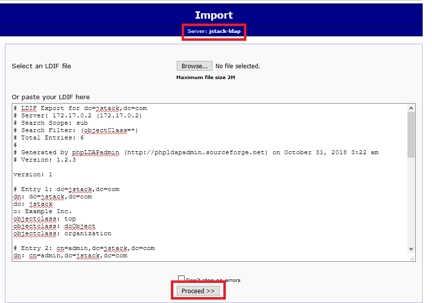

* TOC
{:toc}

## Intro: An Antidote for Infoxication
n

>  **DEDICATION**: This article is dedicated to my fellow companions at the Global SOC, *specilly to Drunken Admiral, Hulk Huggies and Kung-Fu Panda (you know who you are)* **;)**



  

Threat Hunting is as much an operational task as it is one of research and development . We are constantly investigating how threat vectors work and how to best detect them in our environments. As such, having an organized repository with our own plabooks and hunting ideas is a must to keep track of the ever changing threat landscape.

I always tell my students they should have their personal Knowledge Base(s) and treat it with the highest respect. Why? well, you know our profession is one of continuous new developments and information pours from all over: twitter, podcasts, blogs, colleagues, courses, etc. To be successful as a cybersec pro, you need a way to avoid [infoxication](https://en.wikipedia.org/wiki/Information_overload). 

> **Information overload is real** ("alert fatigue" in SOCs is a subtype of it). The reason we should care about it is that **poorly managed information consumption leads to reduced decision making skills**. As leaders, security analysts, responders, threat hunters, red teamers, managers *we are in the frontlines, dealing with threats that come in multiple ways*. **Sharpness of mind** during decision-making workflows is sometimes the difference between achieving our objective or letting the adversaries achieve theirs. 

When mentoring other security analysts, I can never stress enough the importance of having your own KB. Think of it as *a space where you have control of how the information gets in and gets laid out*, an external HDD for your mind. However, your KB is more than just that, statically stored information on a HDD is not the best analogy. 

> **A KB is the place were you tell a story the way you understand it**. By elucidating the connections between the different bits and pieces of data you absorb on a daily basis, you will create [information](https://www.guru99.com/difference-information-data.html): linked data with a context, a purpose and its own semantic field. From simple links about cool tools or blog posts, to complex explanations of a particular topic, *a KB is a must if you want to be at the top of your game*. Nevertheless, finding a nice, simple, cost friendly (ideally **free**) and available way of achieving this is not an easy task.

In the face of this problem, I've kept multiple types of KBs along the years: word documents, simple .txt, OneNote, privately hosted wikis, etc. The problem with these solutions is that they are either **not scalable** (simple documents), **not available** from everywhere (locally hosted), **not elegant** (wikis) or **cumbersome and not automatable** (OneNote). I needed a solution that complied with the following requirements: 

- Markdown AND reStructuredText friendly
- Programatic, that is, allowing automation of some or all of the processes involved in producing documentation
- Code friendly (GitHub, GitLab)
- Graph friendly (*I would like to be able to embed/display* [plotly-style](https://plot.ly/python/histograms/) *graphs created with my Jupyter Notebooks*)
- Secure: 2FA 
- Flexible Access Control and Identity Management: what if I want to give someone access to a *subsection* of my KB?
- Available 24x7x365
- Full Text Search
- Version Control
- FREE! Yes, *as in what William Wallace wanted for Scotland*
- Low footprint (ideally running on less than 512MB RAM)

The first time I saw a solution that was elegant (beautiful and simple) and free was thanks to **darkoperator**'s ([Carlos Perez](https://twitter.com/carlos_perez)) post [here](https://www.darkoperator.com/blog/2017/12/10/nmba1hrmndda8m3eo7ipoh7bxvphz4). He had an excellent idea: *why not just organize your KB as Markdown documents hosted in a Gitlab/Github repo?* You have the advantage they can be rendered as HTML, Gitlab gives you free private repos by default, **and** they enjoy the flexibility of .md (conversion to other formats like pdf, etc.). Needless to say: I went this way, and it meant a huge improvement. However, *there were a few issues*: keeping updated TOC becames a nightmare as the KB grows, HTML rendering by these platforms can be very slow for docos with lots of images and text, lack of design flexibilities, etc. Also, using something like `Github Pages` to address the "lack of design freedom" means my documentation would be publicly available, which defeats the access control requirement. 

So after much (unsuccessful) googling around for a solution that would achieve my goals I decided to compose one myself. That was early 2018 lol, it wasn't until recently that I actually **had the time** to develop this. 

Enter **JSTACK-AWESOMEKB**. In this post, I'm going to walk you through the steps required to setup your own **AwesomeKB**. 

## Deploy your AwesomeKB

**The Jaguar Stack** (*jstack* a **Threat Hunting and IR** [THIR] framework/platform) is a small project I'm working on which hasn't seen the light yet, as the KB is meant to be a module of it, I'm releasing it standalone for the moment. The KB is comprised of the following elements: 

1. Docker for isolation, security, simplicity
2. Sphinx to build the documentation from .rst or .md files as well as full-text search
3. [Authelia](https://github.com/clems4ever/authelia) for 2FA and Granular Access Control
4. AWS for continuous availability and EC2 free-tier facility
5. LDAP server for basic IAM (you can create users and control their access to one or many KBs as well as sections within them)
6. NGINX to serve the KBs as well as reverse-proxy abstraction
7. Redis and Mongo (required by Authelia)

So without further ado, let's get to it shall we? 

### Create an AWS Account

If you don't already have one, please do so just because it's pretty cool. 

### Launch EC2 Instance

1.  Launch a `t2.micro` Ubuntu Server 18 instance

    
   
2.  Select a `t2.micro` instance (*free tier eligible*) and hit "next", accept all defaults.

    
    
3.  Keep accepting defaults until you get to Step 6 **Configure Security Group**. Here make sure you add a rule for HTTPS access (this will allow us to reach our **AWESOMEKB** server from the internet).

    

4. Review and launch the instance. Once the instance is running, grab its public IP or "amazonaws.com" hostname and use the SSH key pair certificate created during the deployment process to authenticate.

>  If you are using Putty to connect to the instance you will have to convert the `.pem` certificate to `.ppk` using **PuttyGen**. If you need help, follow AWS' own [guide](https://aws.amazon.com/premiumsupport/knowledge-center/convert-pem-file-into-ppk/). 

5. Great! by now you should be connected to the EC2 instance via SSH. Let's move on to the next phase.

### Install Pre-Requisites

In order for the KB to work, we need to install a few things like `docker` and `docker-compose`. All these steps are automated in the [jstack-awesomekb](https://github.com/darkquasar/jstack-awesomekb) repo's [deploy.sh](https://github.com/darkquasar/jstack-awesomekb/blob/master/deploy.sh) script, however, I'm going to follow the steps here so you can have a better picture. 

1.  Let's install Docker (if you want to know more check [this](https://medium.com/@cjus/installing-docker-ce-on-an-aws-ec2-instance-running-ubuntu-16-04-f42fe7e80869) post and also [this](https://docs.docker.com/compose/install/#install-compose) one). This is what we need to run: 

    ```bash
    sudo apt-get update \
    && sudo curl -fsSL https://download.docker.com/linux/ubuntu/gpg | sudo apt-key add - \
    && sudo add-apt-repository "deb [arch=amd64] https://download.docker.com/linux/ubuntu $(lsb_release -cs) stable" \
    && sudo apt-get update \
    && sudo apt-get install -y docker-ce apache2-utils \
    && sudo curl -L "https://github.com/docker/compose/releases/download/1.22.0/docker-compose-$(uname -s)-$(uname -m)" -o /usr/local/bin/docker-compose \
    && sudo chmod +x /usr/local/bin/docker-compose \
    && sudo usermod -aG docker ${USER} \
    && echo "Let's create a simple user so that we can access MailCatcher later in the demo environment" \
    && sudo htpasswd -bcB docker/compose/nginx/portal/.htpasswd jaguarlord MyAwesomePassword
    ```
    
What we are doing here is: 

```bash
sudo apt-get update
sudo curl -fsSL https://download.docker.com/linux/ubuntu/gpg | sudo apt-key add -
sudo add-apt-repository "deb [arch=amd64] https://download.docker.com/linux/ubuntu $(lsb_release -cs) stable"
```

We need to add the GPG keys of the docker software repo, this is a way of saying we "trust" what's inside `download.docker.com/linux/ubuntu`. By downloading the key with `curl` piping the file to `apt-key` and appending a dash (`-`) to the end we are telling `apt-key` to read the key from stdin. 

We then add the repository for the version of Linux we are using, which can be automatically obtained by running `lsb_release -cs`.

After that, we must install **docker-ce**, **apache2-utils** (which we will use to generate a *.htpasswd* file that will help us do some simple *http* authentication to access some of the demo services in the stack) and **docker-compose** (by downloading the binary). 

Finally we default *ubuntu* user of the EC2 instance (that is, if you didn't `sudo su`) and we create the abovementioned `.htpasswd` file with a default username of **jaguarlord** and default password of **MyAwesomePassword**. Adapt this last bit to your needs. 

At this point, you will have to close your current SSH session and connect back in so that the non-root **ubuntu** user can issue docker commands without `sudo` as well as making docker-compose foundable by bash. 

> You can automate this process by cloning the repo from the start and using `./jstack-awesomekb/deploy.sh install-prerequisites`

### Deploying JSTACK-AWESOMEKB

Great! if you made it here, the rest is easy. 
1.  Let's begin by cloning the **awesomekb** repo: 

    ```bash
    git clone https://darkquasar@github.com/darkquasar/jstack-awesomekb
    ```
    
2. Generate Certificates (or not ;) If you want to generate your own certificate keys for SSL instead of using the default ones you can do so with (this is also automated in **deploy.sh** with `./jstack-awesomekb/deploy.sh gen-certs`): 

    ```bash
    portal_serv_certpath=jstack-awesomekb/docker/compose/nginx/portal/ssl
    
    # generate the private key
    openssl genrsa -out $portal_serv_certpath/server.key 4096
    
    # generate the certificate signing request, change the subject parameters to whatever you want, I used a city in Argentina ;)
    openssl req -new -key $portal_serv_certpath/server.key -out $portal_serv_certpath/server.csr -subj "/C=AR/ST=Salta/L=Salta/O=J-Stack/CN=JS"
    
    # finally generate the certificate itself
    openssl x509 -req -sha256 -days 999 -in $portal_serv_certpath/server.csr -signkey $portal_serv_certpath/server.key -out $portal_serv_certpath/server.crt
    ```
    
#### Configure the KB to use AWS public Domain

What we need to do now, is to replace the default "jstack.com" site in all of the configuration files (Authelia's one as well as Nginx sites) to whatever your public domain name is for this particular EC2 instance. This is very easy to do, just grab your public DNS name or issue `curl -s http://169.254.169.254/latest/meta-data/public-hostname` from within the bash console  of your EC2 instance (AWS stores some handy metadata inside their containers, very smart and very useful for automation) and use one of two options:

##### Manually doing it

```bash
# Let's store the value of the public DNS name in a variable
publicdns=$(curl -s http://169.254.169.254/latest/meta-data/public-hostname) 

# Let's use find and sed to replace "jstack.com" (must be run from "jstack-awesomekb" root dir)
find ./docker/compose/nginx -type f -print0 | xargs -0 sed -i "s/jstack.com/$publicdns/g"
find ./docker/compose/authelia -type f -print0 | xargs -0 sed -i "s/jstack.com/$publicdns/g"
sed -i "s/awesomekb.jstack.com/awesomekb.$publicdns/g" ./docker/docker-compose.yml
```

##### Using deploy.sh

This will achieve the same results

```bash
publicdns=$(curl -s http://169.254.169.254/latest/meta-data/public-hostname)
./deploy.sh replace-domain $publicdns
```

#### Generating the Documentation with Sphinx
We are almost there, what we need to do now is to make sure there is *some* documentation available in HTML format inside `jstack-awesomekb/docker/compose/nginx/backend/html/awesomekb` so that the backend nginx server can provide us with that site. 

>  **Note:** you can change the default "awesomekb" directory but then you will have to also update the backend awesomekb.conf file.
  
In order to achieve this, we will use a docker container for sphinx, in this case `darkquasar/inca-sphinx:1.0.0`. The `jstack-awesomekb/docs` folder comes pre-populated with a small portion (1%) of my own KB. We will use that as an example for the moment. 

>  you can use whatever you want to achieve the same results like your own sphinx container. darkquasar/inca-sphinx:1.0.0 comes with "m2r" plugin which converts any Markdown documents to their reStructuredText equivalents before sphinx converts them, in turn, to html. It also comes by default with the `readthedocs` theme. You can find the Dockerfile used to build inca-sphinx as **inca-sphinx-dockerfile**

The idea behind using Sphinx is that it is a highly versatile solution, with a prolific developers' community. Learning to write in .rst is not that different from Markdown and it's far more powerful. Sphinx will allow you to document things like your code effortlesly by extracting *docstrings* within them. You can read about this and many other features in their [official site](http://www.sphinx-doc.org)

### Running the KB Stack!

Finally here, change directory to **jstack-awesomekb/docker** then run `docker-compose up --build`. It will essentially build your stack so that's available to be accessed from the outside. 

>  Instead of `docker-compose up --build` you can also run your stack in *detached* mode by appending `-d` to the end. The reason I'm not recommending to do this at this stage is because any errors that might show up will be immediately visible to you, as well as you will be able to see the http logs for all containers directly in *stdout*. This will help you understand what's happening behind scenes. Your choice ofc!
  
#### Configuring DNS

Now there is still something else we need to do. Remember we are running the stack without any privately owned domains right? We are using the AWS auto-generated public ones. This means domain name resolution will not work as usual when you type in your AwesomeKB url. If you type something like this in your browser: `awesomekb.ec2-8-8-8-8.ap-soutwest-3.compute.amazonaws.com` (everything after `awesomekb` being the public hostname assigned by AWS) your browser won't be able to resolve it. Thus, we need to use your own host as a simulated DNS server by editing your "hosts" file and adding entries for your KB. 
First, go to your AWS instance and run this: 

```bash
publicdns=$(curl -s http://169.254.169.254/latest/meta-data/public-hostname)
publicipv4=$(curl http://169.254.169.254/latest/meta-data/public-ipv4)

printf '\n[J-Stack-AwesomeKB] Add these to your hosts file:\n\n%b login.%b \n%b ldapadmin.%b \n%b mailcatcher.%b \n%b awesomekb.%b\n\n' $publicipv4 $publicdns $publicipv4 $publicdns $publicipv4 $publicdns $publicipv4 $publicdns
```

It's output would be similar to this: 

```bash
8.8.8.8 login.ec2-8.8.8.8.ap-soutwest-3.compute.amazonaws.com
8.8.8.8 ldapadmin.ec2-8-8-8-8.ap-soutwest-3.compute.amazonaws.com
8.8.8.8 mailcatcher.ec2-8-8-8-8.ap-soutwest-3.compute.amazonaws.com
8.8.8.8 awesomekb.ec2-8-8-8-8.ap-soutwest-3.compute.amazonaws.com
```

If you wonder, *why wouldn't I be able to just type in `https://awesomekb.ec2-8.8.8.8.ap-soutwest-3.compute.amazonaws.com` or `https://8.8.8.8` and connect anyways?*, well the answer is in here: 



  # Default Server, it will swallow any requests not matching any of the specific 
  # server below. This way, we avoid direct access to the server via 
  # direct Public IP or Cloud DNS (like an Amazon AWS public DNS name)
  server {
    listen 443 ssl default_server;
    server_name _;
    return 404;

    ssl on;
    ssl_certificate     /etc/ssl/server.crt;
    ssl_certificate_key /etc/ssl/server.key;
  }
  


We have configured our nginx frontend portal to decline any connections made to a server other than the ones listed explicictly in the config (like [awesomekb.jstack.com]()). This server is called a *default server* and comes first in the list. The idea is to sinkhole any non-compliant attempts to access our webserver. **This way, there is only one entrance: via Authelia and 2FA**. 

>  **What if I have my own domain.com?** well that's great, keep reading as I provide some guidance on that too further below.

### Accessing your AwesomeKB

We have the stack up and running now, you can head to [https://awesomekb.whatever-amazonaws.com]() and you shall be presented with Authelia's login screen: 


It looks great, however, you won't be able to login yet, why? Because we need to at least create one user in our LDAP server so that he/she/them/it/you (personal pronouns in times of gender fluidity are a tricky thing to get right) can login. 

#### Adding users and groups to LDAP Server

Let's open another tab and head to "https://ldapadmin.whatever-amazonaws.com", you will be redirected to the frontend PHP admin interface for the backend ldap. **This is secured via simple http login** (*remember we created the .htpasswd file before?*) so type in the creds for this user and logon!


Once there, you can either create your own LDAP structure (add users and groups, set permissions) or you can just import the default [base.ldif](https://github.com/darkquasar/jstack-awesomekb/blob/master/docker/compose/ldap/base.ldif) file that comes with the repo. To do this, login to your LDAP instance using **cn=admin,dc=jstack,dc=com** as the user and **password** as the pass (assuming you left the defaults in place in the [docker-compose.yml](https://github.com/darkquasar/jstack-awesomekb/blob/master/docker/docker-compose.yml) file). Once logged on, hit `import` in the upper left corner, copy the contents of base.ldif and paste them in the field. Click on "proceed" to import the structure. 



It may throw some errors, but don't worry, the essential group and user will be created: 


#### Finally Logging in!

So, once at this point, let's head to the logon screen once more, type in the username (`jaguar01`) and password (`password`) and Authelia will take you to the *2nd factor logon screen*: 


Authelia will confirm that it has sent an email to the email address belonging to the user (as per their LDAP record). 


We configured Authelia so that *MailCatcher* can mimic a real world scenario where Authelia would send an email to the end user, that config is here: 

```yml
notifier:
  # For testing purpose, notifications can be sent in a file
  ## filesystem:
  ##   filename: /tmp/authelia/notification.txt

  # Use your email account to send the notifications. You can use an app password.
  # List of valid services can be found here: https://nodemailer.com/smtp/well-known/  
  ## email:
  ##   username: user@example.com
  ##   password: yourpassword
  ##   sender: admin@example.com
  ##   service: gmail
  
  # Use a SMTP server for sending notifications
  smtp:
    username: test
    password: password
    secure: false
    host: 'smtp'
    port: 1025
    sender: admin@jstack.com
```

You can also tell Authelia to use any other mailing service that [nodemailer](https://nodemailer.com/smtp/well-known/) is capable of using. For example, I created a dummy gmail account to use as the sender. 

> **NOTE**: Bear in mind that, should you use gmail, you will have to configure it to accept logon requests from [less-secure](https://support.google.com/cloudidentity/answer/6260879?hl=en) apps.

So in the previous step, select **google authenticator** as the 2nd factor token. It will automatically send an email to *MailCatcher*. Let's head there [https://mailcatcher.whatever-amazonaws.com](): 


Once you click on "continue" you will be redirected to the page with the QR code for your phone to pick up the Google Authenticator account. 

**Done!**

If you now head to [https://awesomekb.whatever-amazonaws.com]() you will be able to use 2FA to login to your A-M-A-Z-I-N-G KB!

## But, is it really FREE?

Well here's the thing: *you can run this KB stack on any virtual machine in the cloud with 1vCPU and 1GB RAM*. You don't need more than that. Amazon gives you *750hs for free* out of instances in the **free tier** (BTW: I don't work for Amazon, they just happened to be the cloud providers I went with, but I also use Azure and others).
 
Once you run out of the 750hs, the `t2.micro` instance will only cost you an astonishing **$0.20 cents per day**. If it costs me *$0.20 cents/day* to have my own KB up and running, I don't believe that's a bad deal ;)

## Continuous Documentation Builds

What if you want to push changes to the documentation in your repos and have it automatically reflected on your AwesomeKB? You have 3 answers here: 

1. Use ReadTheDocs
2. Create a Cron job
3. Develop a script that can understand Github Webhooks

In my case, I used **2** for the moment, since I don't have enought time (*what a limited resource!*) to develop the other options. So I will explain to you this one, because it's the easiest way of getting up and running. 

1. Download `keychain` (`sudo apt-get install -y keychain`)
2. Generate your SSH keys for the git service you connect to, in my case, Github: `ssh-keygen -t rsa -b 4096 -C "admin@jstack.com"` (accept defaults, it will store private and public key inside your `~/.ssh`) dir.
3. Run ``eval `keychain --eval id_rsa` `` to load your profile for the first time. It will ask you the password to your `id_rsa` private key. Once done, you won't have to type in the password for the private key again in the same session. 
4. Add `` eval `keychain --eval id_rsa` `` to your `.bashrc` file, so it gets executed upon logon at any time. 
5. Connect to Github.com to add the host key to your trusted hosts file for the first time and test connectivity: `ssh -Tv git@github.com` if all is good you shall see a message like *Hi dude! You've successfully authenticated, but GitHub does not provide shell access.*
6. Run `crontab -e` and append at the end the command to launch the `git_pull_cron` function inside `deploy.sh`. In my case, I run it every minute and it looks like this: 

  ```bash
  * * * * * /home/dude/jstack-awesomekb/deploy.sh git-pull-cron dude/mykb awesomekb.jstack.com # where "dude/mykb" is the git repository
  ```

  The first parameter is the name of your repo (**note:** your repo must contain a **docs** directory where your documentation structure is stored), the second is the name of the backend virtual server you want to output the produced documentation into (it will get dropped in *[current_repo_dir]/docker/compose/nginx/backend/html/[name_of_virtual_server]*). Remember that the name of your virtual server (in this example *awesomekb.jstack.com*) needs to match up with what's written in all the nginx configuration files for the portal and backend nginx servers. 
  
Done! now Cron will run the command every minute which will check your git repo and pull any commits (this way you only pull the *diffs* between commits). 

Since the folder we are dumping the created documentation into is mapped to the *backend nginx* server, nginx will serve the new files. 

## Security Considerations

There are a few security concerns that we need to address. First, you may not completely trust a solution like Authelia for a variety of reasons like exploits could be available for the libraries it uses and there could be bugs in the platform itself. However, let's point out some things: 

1. Any library out there can be exploited. Authelia uses code from multiple Node.js libraries and relies on them as a bazillion other apps do. Guys in the repo have been quite active in finding bugs and reporting them. The developer, [Clément Michaud](https://github.com/clems4ever) is highly responsive in this regard.
2. We run all the stack in docker, which provides abstraction, which means even if one of the web servers gets compromised via some RCE vuln, intruders would only be able to browse the container itself, not the host machine. 
3. Our EC2 instance is configured to only allow traffic to the HTTPS and SSH ports.
4. We are logging everything with [docker-logger](https://github.com/umputun/docker-logger) to a persistent location in the host machine. Tweak the parameters in docker-compose if you would like to keep bigger logs than the default ones.
5. Once you finish your initial setup, you should disable single-factor access to ldapadmin.whatever.com as well as mailcatcher.whatever.com. You could configure them to be accessible via Authelia itself, or disable them altogether by erasing the `server {}` blocks in nginx.conf of the portal. Ideally, you would already have your LDAP database created before running the LDAP server, this way, you won't even need to access it for the first time. You could choose to run a different OpenLDAP docker image. The one I use has the ability to use bootstrap to [create users/groups](https://github.com/osixia/docker-openldap/tree/stable/example/extend-osixia-openldap/bootstrap/ldif) at run time.

### Can we increase security?

Totally, you could deploy [fail2ban](https://www.linode.com/docs/security/using-fail2ban-for-security/) to configure jails for your host and thus prevent **bruteforce** attacks by banning suspicious IPs. A clever guy in the Authelia repo already published a [guide](https://github.com/clems4ever/authelia/issues/178) on how to do this with Authelia. Since we are logging logs from our containers into a host-based persistent volume, we should point the logs in `jail.local` to the authelia log files in our volume (also change `backend = systemd` to `backend = polling`, so it will poll those log files instead of relying on systemd, since we are using docker).

>  **Note**: I was able to set this all up and I could see how *fail2ban* would populate `iptables` with the blocked IPs. SSH bruteforce was effectively blocked, however, for some reason, HTTP access kept being accepted, regardless of iptables explicictly blocking the ip for all protocols. I did some `tcpdump` debugging and couldn't find any issues. I don't exactly know why this is the case (I sense it has something to do with AWS), if you get it working on your side, please ping me, post a comment or open an issue/PR in the github repo. 
  

### Can we increase security even more? 

Of course you can! Here are two ideas: 

#### 2+1FA With auth_basic

Make your KB 2+1FA (2 times password based + 1 time token based, it is not 3FA since we are not using a different category of authentication, but only twice "something you know" and once "something you have"). You can do this by adding `auth_basic` to your backend server's `awesomekb.conf` so that you would have to enter another set of creds to *actually be able to visualize your KB contents*.

#### 2+2FA With Cloudflare

>  This option sort of defeats the purpose of using Authelia altogether, but you can choose to use either one of them, or both combined for *extra-super-duper-hilarious access control* (a bit of an overkill, but why not eh?). Downside to using Cloudflare is that you will be limited to authorizing 5 users under the free-tier whereas with Authelia **you control the authentication server**.
  
If you are using Cloudflare like me, you can use [Cloudflare Access](https://www.cloudflare.com/products/cloudflare-access/) (or any other service that does something similar). Which essentially will allow you to authenticate up to 5 users for free using common identity providers (Github, Google, etc.). This way, if you have 2FA enabled for any of those providers, you will have **2FA via Cloudflare on top of 2FA via Authelia**


### Can we increase security even more?

There is always more you can do my friend!. For example, have a look at [https://github.com/Jsitech/JShielder](https://github.com/Jsitech/JShielder) and have fun. 

## Can we make this AwesomeKB even more Awesome? 

Now that you ask, there are three things on the pipe, which, if I find time to add -and they fit within an EC2 t2.micro instance without degrading access performance- I will: 

1. Add [GoAccess](https://goaccess.io/get-started) Log Analyzer. This will allow us to visualize stats about any visits to your KB from a nice web-based gui.
2. Add a ReadTheDocs server, so that connecting to your private GitHub repo hosting your **amazing documentation** and updating your docs would be a breeze. 
3. If deploying ReadTheDocs is an overkill, then adding a commandline option to the **darkquasar/inca-sphinx** so that it listens for Github webhooks and re-builds the documentation that way. 

Have any other ideas? Please feel free to send me a PR or propose new things. 

## Credits

All I've done is cobbling up some things together in an attempt of doing some **SecDevOps** work. Credit goes in all honesty to: 

- Authelia developer, Clément Michaud (dude I don't have your twitter, otherwise I would link it) who not only created the app but also already had a docker-compose with the initial features configured.
- Docker and Sphinx community
- stackoverflow.com (oh yeah!)
